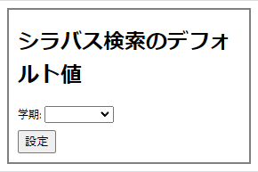

# 学務情報システムのシラバス検索画面のデフォルト値を変更する
学務情報システムのシラバス検索画面での項目のデフォルト値を変更します。  
4ターム制が導入されて履修登録の際のシラバスの検索に春や秋学期が指定されるようになり、シラバス検索の際に毎回「全学期」や「後学期」に変えるのがめんどくさくなったので作りました。


## 動作確認済みブラウザ
- Chrome
- Edge
- Vivaldy

※Chromiumベースのブラウザなら動くと思います(たぶん)。firefoxは対応してません。

## インストール方法
1. 任意のディレクトリに、リポジトリを[ダウンロード](https://github.com/Yuki-Yui/GakumuJouhousystem_Default_Select/archive/refs/heads/main.zip)するか ```git clone``` する
1. 拡張機能のページ(chrome://extensions/)に移動し、画面右上のデベロッパーモードをオン
1. 画面上部の「パッケージ化されていない拡張機能を読み込む」をクリックし、ダウンロードしたフォルダを選択する

## 設定方法（Chromeの場合）
別のブラウザでもだいたい同じです。
1. 学務情報システムを開く
1. Chrome画面右上、タスクバーの拡張機能マークをクリック　 ←これ
1. その中から ```学務情報システムのシラバス検索画面での選択項目をデフォルトの値にします。``` をクリック  
 

1. 出てきたポップアップウィンドウで値を選択して ```設定``` ボタンをクリック  
 
1. ページをリロードすると次回から適用されます